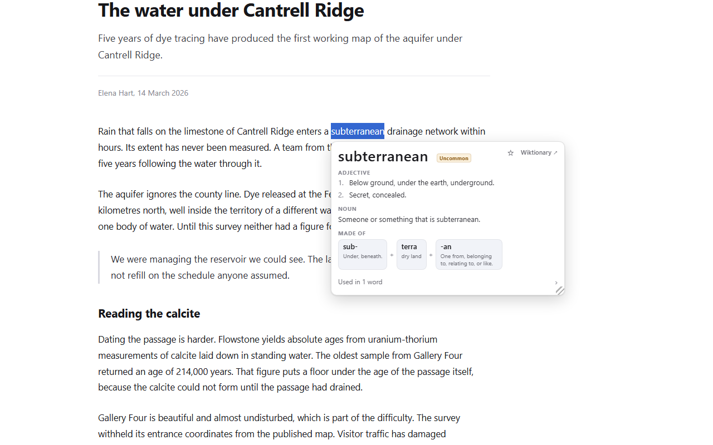
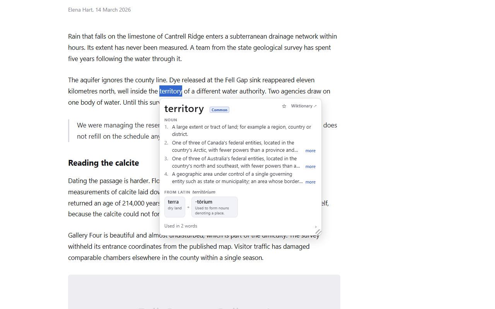
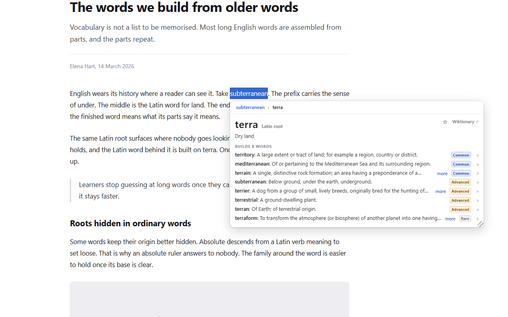
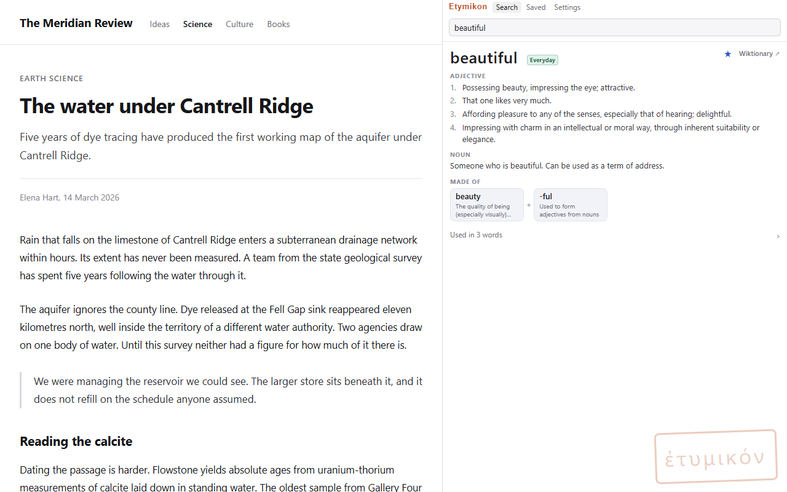
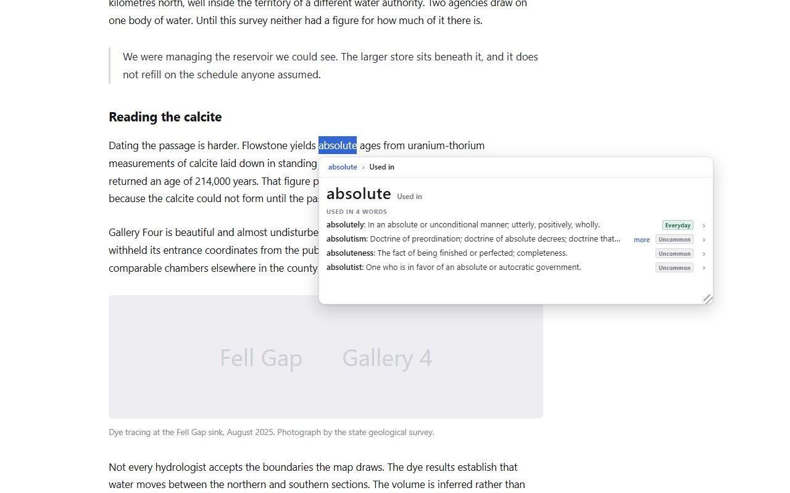

# Etymikon: Word Roots Popup Dictionary

Chrome extension (Manifest V3). Select an English word on any page and a
popup card shows its definitions and its morpheme breakdown
(subterranean = sub- + terra + -an). Words that English borrowed
already assembled show the assembly instead: territory reads FROM LATIN
territōrium, terra + -tōrium, and each part is clickable.

Each morpheme opens a root card: the root's form, its source, its
gloss, and the English words built on it, ranked by frequency and
paginated. Word cards link upward too: "Used in N words" lists what
English builds on the word, so the whole family can be walked in either
direction with a breadcrumb trail. Every word carries a frequency tier
chip (Everyday, Common, Advanced, Rare), and inflected selections
resolve to their lemma: selecting "running" finds run, "territories"
finds territory.

The toolbar icon opens a sidebar with typed search over the same cards,
and the omnibox keyword `et` searches from the address bar. The star on
any card saves it into folders; folders export to Anki or CSV.

The shipped dictionary holds 82,846 words, 2,831 roots (English affixes
beside Latin and Greek lemmas), and 108,407 inflection mappings, built
from Wiktionary at build time. Lookups work offline. The extension
makes no network requests of any kind.

The name is Greek: etymos ("true sense") + -ikon, the formation behind
lexicon. The Byzantine etymological dictionaries were titled
Etymologikon.

## Layout

- `SPEC.md`: the binding spec. Behavior is pinned there before it is
  built.
- `extension/`: the unpacked extension (load via chrome://extensions,
  Developer mode, "Load unpacked").
- `pipeline/`: build-time data pipeline. `python pipeline/build.py`
  downloads the Wiktionary extracts from kaikki.org, parses and curates
  them, and emits `extension/data/`. Release tooling (icons, promo,
  screenshots, zip) lives here too. See `pipeline/README.md`.
- `test/`: Node test suite, run with `node test/lookup.test.mjs`.
- `test-page/`: browser self-check harness pages; serve the repo over
  http and press each page's run button.

## Provenance

This repository is a fork of [Okpyeon](https://github.com/jjm4000/okpyeon)
(a hanja popup dictionary) at tag v1.1.0. The shell (popup, sidebar,
saved words, navigation, tooling) carries over; the language core is
new. Dictionary content is built from the English, Latin, and Ancient
Greek editions of Wiktionary via kaikki.org extracts (CC BY-SA), with
word frequencies from hermitdave/FrequencyWords (MIT). See
`extension/data/DATA-LICENSE.md`.
