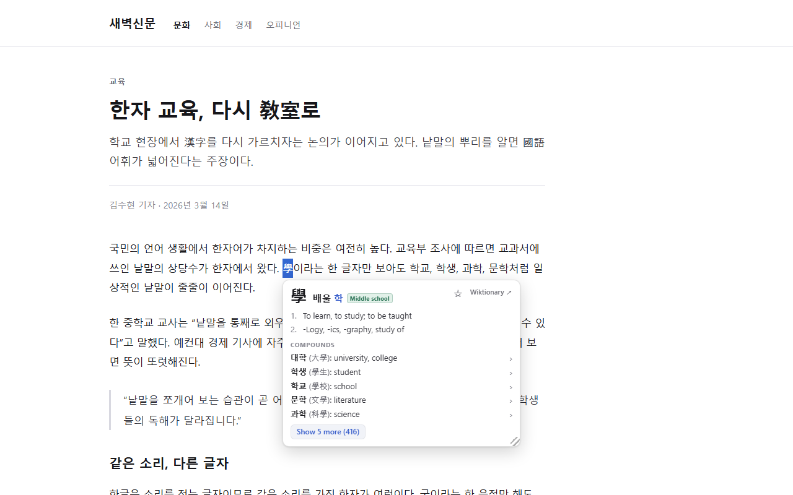
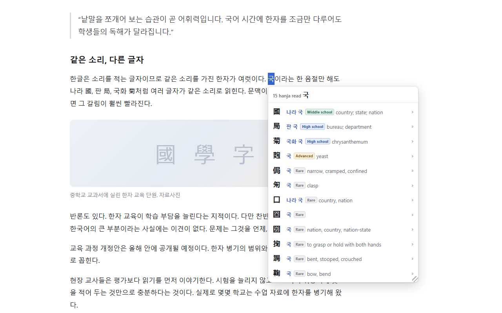
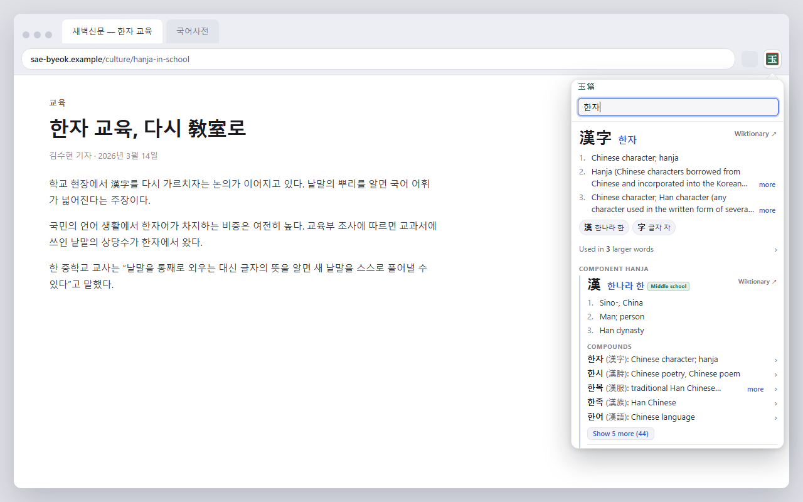

# Okpyeon: Hanja Popup Dictionary

A study tool for Korean learners. Highlight hanja, hanzi, or kanji on any page
to read them in Korean, or highlight a Korean (hangul) word to see its hanja.
You can also type a query into the toolbar popup or the address bar.

옥편 (玉篇) is the traditional Korean word for a hanja dictionary.



## What it does

- **Characters into Korean.** Select a hanja to see its eumhun (나라 국 for
  國), its readings, English definitions, and the compounds it appears in.
  Simplified Chinese and Japanese shinjitai forms (国, 学, 気, 図) resolve to
  the same entries, so the extension works on Chinese and Japanese pages too.
- **Korean words into hanja.** Highlight a Sino-Korean word written in hangul
  (국민) to see the hanja behind it (國民) along with its meaning and its
  component characters. Grammatical endings are handled: 자본주의는 still
  finds 자본주의.
- **Word breakdown.** Long compounds split into component words (자본주의 →
  資本 + 主義). Character cards list their compounds five at a time, and word
  cards can list the larger words that contain them. Every entry is clickable,
  and a breadcrumb trail takes you back to any earlier step.
- **Browse by sound.** Highlight a single hangul syllable (국) to list every
  hanja with that reading, with schoolbook characters at the top.
- **Character levels.** Every character is marked Middle school, High school,
  Advanced, or Rare. The first two follow the Korean Ministry of Education
  curriculum lists. Advanced and Rare are Okpyeon's own classification, and
  the tooltips state that.
- **Search.** The toolbar button opens a small search popup, and typing `hj`
  in the address bar searches from there. Both show the same cards as
  highlighting does.
- **Wiktionary links.** Each card links to its Wiktionary entry. Links open
  in a background tab, so the popup stays open.
- **Resizable.** Drag the popup's corner to resize it. The size is kept for
  the rest of the page visit.
- **Native words.** Native Korean words show nothing rather than a forced
  match. When a common native word shares its sound with an obscure hanja
  spelling (사랑 and 舍廊), the entry is labelled a rare homograph instead of
  being presented as the word's origin.
- **Private and offline.** The whole dictionary ships inside the extension.
  It makes no network requests and collects no data. See
  [privacy-policy.html](privacy-policy.html).



*Browsing every hanja read 국.*



*The toolbar search popup.*

## Install

From the Chrome Web Store: (pending review)

From source: clone this repo, open `chrome://extensions`, enable Developer
mode, and use **Load unpacked** on the `extension/` folder. The dictionary
data is committed, so no build step is needed just to run it.

## Repository layout

```
extension/     the extension itself (MV3); data/ holds the built dictionary
pipeline/      build tooling: dictionary build, icons, promo tiles, store zip
test/          Node unit tests for the lookup logic
test-page/     standalone browser test page with self-checks (no build needed)
screenshots/   store listing assets
SPEC.md        the internal spec the implementation follows
```

## Building the dictionary

```
python pipeline/build.py
```

Downloads the source corpora into `pipeline/cache/` on first run (~412 MB:
kaikki.org Wiktionary extracts for Korean/Translingual/Japanese, Unicode
Unihan, a subtitle-derived frequency list), then builds
`extension/data/*.json` in about 11 seconds from a warm cache and verifies the
output against a set of anchor entries. See `pipeline/README.md` for details.

Tests:

```
node test/lookup.test.mjs
```

UI self-checks: open `test-page/index.html` in a browser and press
"Run self-checks".

## Licenses

- **Code**: [GPL-3.0](LICENSE).
- **Dictionary data** (`extension/data/*.json`): CC BY-SA 4.0, derived from
  English Wiktionary (via kaikki.org), the Unicode Unihan database, and the
  Korean Wikipedia curriculum table. See
  [extension/data/DATA-LICENSE.md](extension/data/DATA-LICENSE.md) for full
  attribution.
