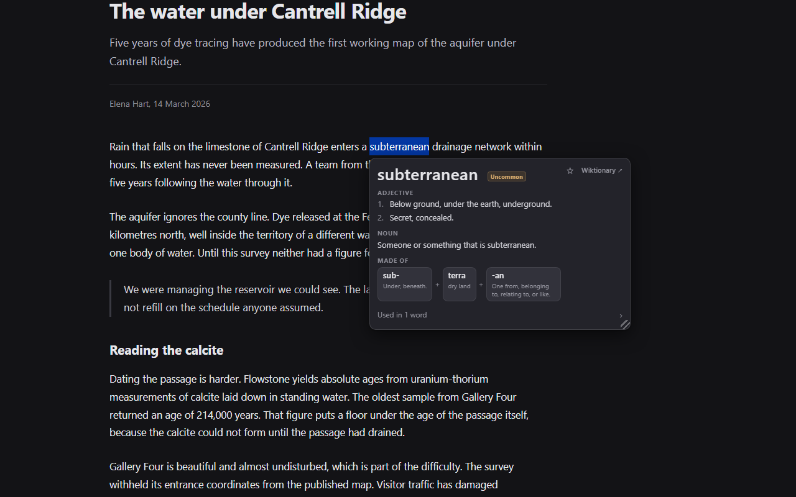

# Etymikon: Word Roots and Etymology Popup Dictionary

Chrome extension (Manifest V3). Select an English word on any page and a
popup card shows its definitions and its morpheme breakdown
(subterranean = sub- + terra + -an).

Words that English borrowed already assembled show the assembly instead:
territory reads FROM LATIN territōrium over chips for terra ("dry land")
and -tōrium ("used to form nouns denoting a place").

Each morpheme opens a root card: the root's form, its source, its gloss,
and the English words built on it, ranked by frequency. The -ful card
builds 360 of them.

A Latin or Greek word that English borrowed already assembled carries its
own breakdown on its card. accēdō ("to go or come toward") reads ad- +
cēdō, and the cēdō card lists the 44 English words that reach it,
necessary and access among them. Word cards run the other way as well:
absolute reads "Used in 4 words", which opens absolutely, absolutism,
absoluteness and absolutist.

Every word carries a frequency tier chip (Everyday, Common, Uncommon,
Rare), and a definition states its register where the source marks
one, so the fourth sense of accede reads "archaic To approach; to
arrive, to come forward". Words whose source is neither Latin nor Greek
still say where they came from on one quiet row: sky reads "From Old
Norse ský (cloud)". A form in a non-Latin script carries its
romanization, so the Greek chip under ephemeral reads ἡμέρα, hēmérā,
"day".

The toolbar icon opens a sidebar with typed search over the same cards,
and the omnibox keyword `et` searches from the address bar. Cards save
into folders, and folders export to Anki or CSV.

The shipped dictionary holds 87,161 words, 9,223 root cards (English
affixes, Latin and Greek lemmas, and 1,414 proper nouns), and 114,842
inflection and spelling mappings, so selecting "territories" opens
territory. It is built from Wiktionary at build time. The data files come
to 25.6 MB and ship inside the extension, so lookups run with no
connection.

The name is Greek: etymos ("true sense") + -ikon, the formation behind
lexicon. The Byzantine etymological dictionaries were titled
Etymologikon.

## Layout

- `SPEC.md`: the binding spec. Behavior is pinned there before it is
  built.
- `extension/`: the unpacked extension (load via chrome://extensions,
  Developer mode, "Load unpacked").
- `pipeline/`: build-time data pipeline. `python pipeline/build.py`
  downloads the Wiktionary extracts from kaikki.org, parses and curates
  them, and emits `extension/data/`. Release tooling (icons, promo,
  screenshots, zip) lives here too. See `pipeline/README.md`.
- `store-listing.md`: the record of what is in the Chrome Web Store
  dashboard, updated after every upload.
- `test/`: Node test suite, run with `node test/lookup.test.mjs`.
- `test-page/`: browser self-check harness pages. Run them headless with
  `python pipeline/run_selfchecks.py`, or serve the repo over http and
  press each page's run button. They have to be served either way: the
  pages import the extension's own modules.

## Provenance

This repository is a fork of [Okpyeon](https://github.com/jjm4000/okpyeon)
(a hanja popup dictionary) at its tag v1.1.0, which this repository tags
`okpyeon-v1.1.0`. The shell (popup, sidebar,
saved words, navigation, tooling) carries over; the language core is
new. Dictionary content is built from the English, Latin, and Ancient
Greek editions of Wiktionary via kaikki.org extracts (CC BY-SA), with
word frequencies from hermitdave/FrequencyWords (MIT). The derived
dictionary data is distributed under CC BY-SA 4.0; the source code is
GPL-3.0. See `extension/data/DATA-LICENSE.md`.
