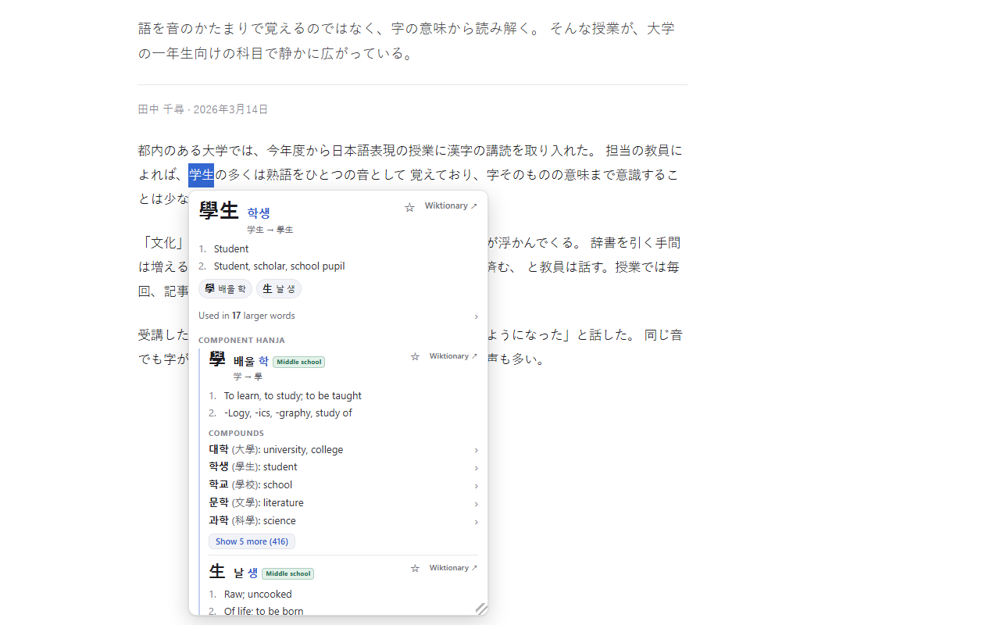
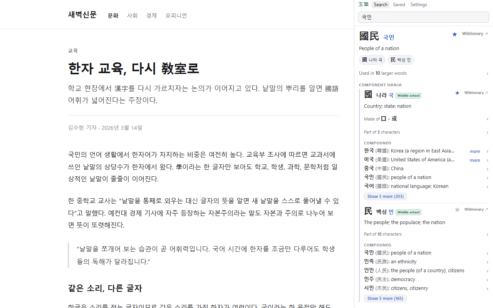
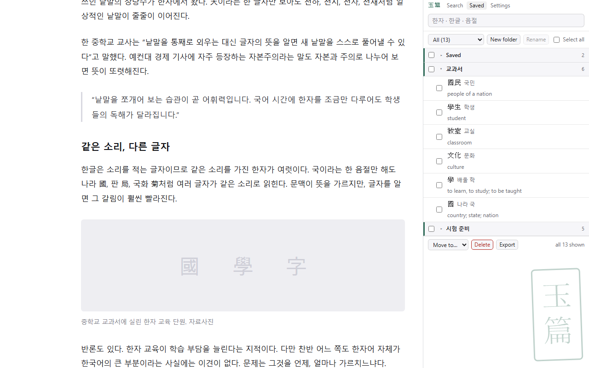

# Okpyeon: Hanja Popup Dictionary

A study tool for Korean learners. Highlight hanja, hanzi, or kanji on any page
to read them in Korean, or highlight a hangul word to see its hanja. The
toolbar button opens a sidebar with typed search, saved words, and settings;
typing `hj` in the address bar searches from anywhere.

옥편 (玉篇) is the traditional Korean word for a hanja dictionary.


## What it does

- **Characters into Korean.** Select a hanja to see its eumhun (나라 국 for
  國), readings, English definitions, and common compounds. Simplified Chinese
  and Japanese shinjitai forms resolve to the same entries, so those pages
  work too.
- **Korean words into hanja.** Highlight a Sino-Korean word in hangul (국민)
  to see its hanja (國民), meaning, and component characters. Grammatical
  endings are handled: 자본주의는 finds 자본주의.
- **Word breakdown.** Compounds split into component words (자본주의 → 資本 +
  主義). Everything is clickable, and a breadcrumb trail returns to any
  earlier step.
- **Browse by sound.** Highlight a single syllable (국) to list every hanja
  read that way. Readings on cards are links too: a character's eum opens its
  homophone list, and a word's hangul shows its other spellings.
- **Character levels.** Each character is marked Middle school, High school,
  Advanced, or Rare. The school levels follow the Ministry of Education
  curriculum; Advanced and Rare are Okpyeon's own classification, and the
  tooltips say so.
- **Sidebar search.** The sidebar shows the same cards as highlighting does,
  and it stays open across tabs and page loads.
- **No Korean keyboard needed.** Typing `toddlf` (the 2-set layout on an
  English keyboard) finds 생일, and typing `gungmin` or `gukmin`
  (romanization) finds 국민. A query that could be read both ways shows
  both.
- **Saved words.** The star on any card saves the entry, with a bubble to pick
  or create its folder. The Saved view manages folders, with batch move and
  delete.
- **Export.** Saved words export as an Anki text file or as CSV. Settings
  picks the Anki card fields and the default folder, and folder names become
  Anki tags.
- **Wiktionary links.** Every card links to its Wiktionary entry. Links open
  in a background tab, so the card you are reading stays open.
- **Resizable.** Drag the in-page popup's corner to resize it. The size holds
  for the rest of the page visit.
- **Native words.** Native Korean words show nothing rather than a forced
  match. A native word that shares its sound with an obscure hanja spelling
  (사랑 and 舍廊) is labelled a rare homograph, not the word's origin.
- **Private and offline.** The whole dictionary ships inside the extension.
  It makes no network requests and collects no data. Saved words stay on your
  device. See [privacy-policy.html](privacy-policy.html).



*学生 selected on a Japanese page, resolving to 學生.*



*The sidebar's search view.*



*Saved words in folders.*

## Install

From the Chrome Web Store: (pending review)

From source: clone this repo, open `chrome://extensions`, enable Developer
mode, and use **Load unpacked** on the `extension/` folder. The dictionary
data is committed, so no build step is needed just to run it.

## Repository layout

```
extension/     the extension itself (MV3); data/ holds the built dictionary
pipeline/      build tooling: dictionary build, icons, promo tiles, store zip
test/          Node unit tests for the lookup logic
test-page/     standalone browser test page with self-checks (no build needed)
screenshots/   store listing assets
SPEC.md        the internal spec the implementation follows
```

## Building the dictionary

```
python pipeline/build.py
```

Downloads the source corpora into `pipeline/cache/` on first run (~412 MB:
kaikki.org Wiktionary extracts for Korean/Translingual/Japanese, Unicode
Unihan, a subtitle-derived frequency list), then builds
`extension/data/*.json` in about 11 seconds from a warm cache and verifies the
output against a set of anchor entries. See `pipeline/README.md` for details.

Tests:

```
node test/lookup.test.mjs
```

UI self-checks: open `test-page/index.html` in a browser and press
"Run self-checks".

## Licenses

- **Code**: [GPL-3.0](LICENSE).
- **Dictionary data** (`extension/data/*.json`): CC BY-SA 4.0, derived from
  English Wiktionary (via kaikki.org), the Unicode Unihan database, and the
  Korean Wikipedia curriculum table. See
  [extension/data/DATA-LICENSE.md](extension/data/DATA-LICENSE.md) for full
  attribution.
